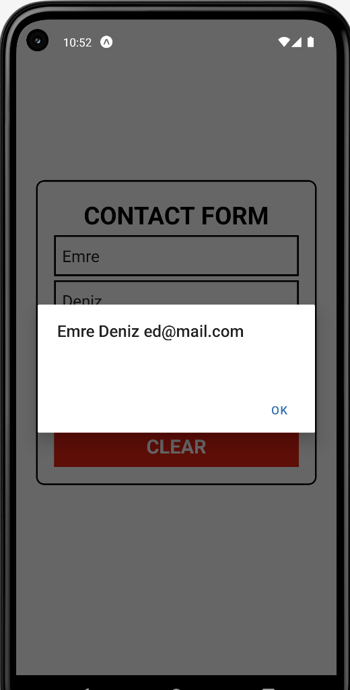

# React-Native-Lab_3
React native form to collect data from the users

### HOW TO RUN:
```console
npm install
npx expo start
```

### DESCRIPTIONS:
Features:
1. Gets contact information from users via the **form**.
2. Displays the inputs that user entered with **Send Button**.
3. Clear all input fields with **Clear button**.

### SCREENSHOTS:
<kbd></kbd>    <kbd></kbd>
